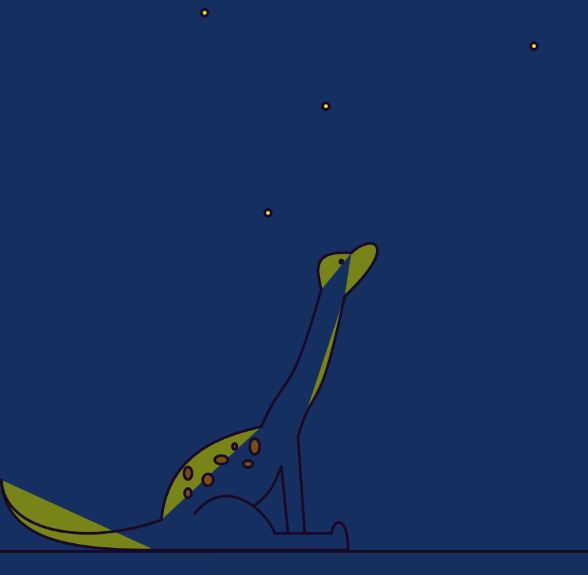

# Final Project- Interactive Graphics and Critical Code

Name:  

Date:

## Project: Significance(?)

### Conceptual Description

I want my piece to be lighthearted and resemble the fact that a life should be measures by how you approach each day, your faithful to all those you love, and the quality of your friendships. As a senior, I feel success is defined by how much an individual will conquer once they leave Duke. People seem to be making lifetime  decisions based on the fear of peer comparison instead of the joy of curiosity. Though this piece, I seek to alleviate the stress seniors may feel with this vast sea of unknowns at our doorstep through a reminder that a sence of "place" is relative. I will do this by drawing on one of my biggest idols: Bill Watterson. 

### Interaction Description

At this point, I do not have any interactions in this piece 

### Extension 

I intend to make my dinosaur piece into an interaction with three seperate classes. One class will be the dinosaur looking left, the next looking right, and the final looking up at the starts and saying "I'M SIGNIFICANT! Screamed the dust speck" 



### Drawing or Sketch of Extended Piece


### Technical Details
//   
Here you should give an overview of the technical aspects of your project:
* Libraries your using
* Hosting Platform (Heroku, Github Pages)
* Explanation of your codebase  
//

You can include code snippets here:

```js
functions setup(){

}

function draw(){

}
```

Link to your project's full code in this repository:  [https://github.com/duke-interactive-graphics/face-osc](https://github.com/duke-interactive-graphics/face-osc)
